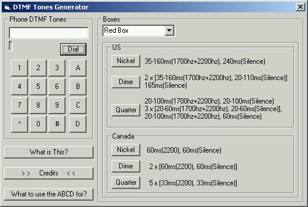

<div align="center">

## DTMF tone generator


</div>

### Description

Lets You hold Your telephone in front of Your speaker, and this program will dial for You.
 
### More Info
 
Keypresses

Weird sounds (Sound generated by adding two sine-waves)

Telephonebill...


<span>             |<span>
---                |---
**Submitted On**   |2004-11-19 19:39:14
**By**             |[Bobbek](https://github.com/Planet-Source-Code/PSCIndex/blob/master/ByAuthor/bobbek.md)
**Level**          |Intermediate
**User Rating**    |4.9 (73 globes from 15 users)
**Compatibility**  |VB 6\.0
**Category**       |[Sound/MP3](https://github.com/Planet-Source-Code/PSCIndex/blob/master/ByCategory/sound-mp3__1-45.md)
**World**          |[Visual Basic](https://github.com/Planet-Source-Code/PSCIndex/blob/master/ByWorld/visual-basic.md)
**Archive File**   |[DTMF\_tone\_1965431152006\.zip](https://github.com/Planet-Source-Code/bobbek-dtmf-tone-generator__1-64048/archive/master.zip)

### API Declarations

```
' modWAV - WAV File Routines
'
' Written By: David M.Hitchner
```


